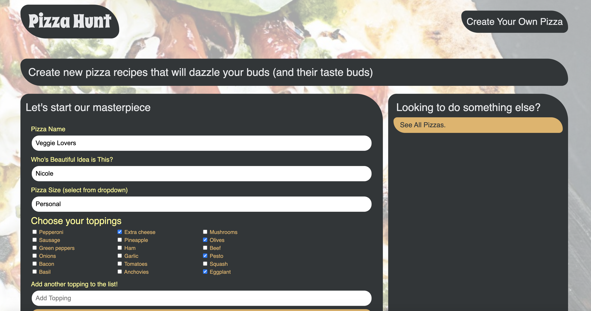
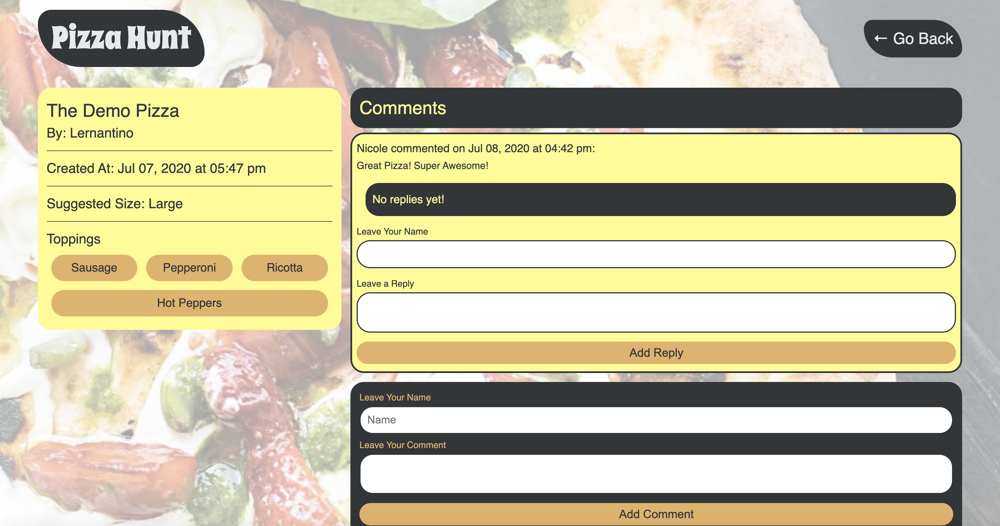

# Pizza-Hunt 

## Description 
This project is a social networking application for pizza lovers using MongoDB and Mongoose. This application demonstrates structure within a NoSQL database by validating information and structured models. This application will also run when internet connection is lost.

## Table of Contents
* [Installation](#installation)
* [Usage](#usage)
* [License](#license)
* [Contributing](#contributing)
* [Tests](#tests)
* [Questions](#questions)

## Installation 
The user should clone the repository from GitHub. This application requires Express, MongoDB, and Mongoose. Make sure your local device has MongoDB installed. Then clone git repository and run `npm install i`. Once dependencies are installed run `npm start` to connect to server.

## Usage 
This application will allow users to create their favorite type of pizza to be posted to the main page. From there other users can comment to an individual pizza post and reply to other users comments to make a thread. 
Please view deployed live Heroku [URL](https://nw-pizza-hunt.herokuapp.com/)
 

## License 
This project is license under MIT

## Contributing 
Contributors should read the installation section. 

## Tests
There are no tests for this application. 

## Questions
If you have any questions about this projects, please contact me directly at nicole.elisaw@gmail.com. You can view more of my projects at https://github.com/nicolewallace09.